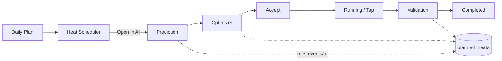

# MES Production Planning — Implementation Report

**Date:** 2026-07-10  
**Scope:** Manufacturing Execution System–style planning & execution around existing AI  
**Status:** Complete

---

## Non-negotiables (unchanged)

- Phase 19 Prediction Model  
- Phase 20.2 Optimizer / Phase 31 Optimizer V2 / Phase 32 Hybrid Engine / Phase 33 Hybrid APIs  
- Phase 40 Enterprise Authentication  
- Heat Management Database schema (`heat_records` base + existing columns)  
- ML algorithms, feature engineering, pickle files  

MES data lives in **`enterprise.db`** and links to heats by `heat_number` / optional `heat_record_id`.

---

## Database schema (`MES_SCHEMA`)

| Table | Purpose |
|-------|---------|
| `production_plans` | Daily plan: date, shift, furnace, grade, heat count, tonnage, TTT, productivity, energy, priority, status |
| `planned_heats` | Scheduler: heat number, grade, charge, window, operator/shift/furnace, recipe JSON, status ladder, timeline JSON |
| `mes_timeline_events` | Event log with durations between stages |

**Plan status:** Draft → Approved → Running → Completed  

**Heat status engine (forward-only):**  
Draft → Planned → PredictionComplete → OptimizationComplete → Approved → Running → Tapped → Validation → Completed → Archived  
(+ Delayed / Cancelled)

---

## APIs (`/mes/*`)

| Area | Endpoints |
|------|-----------|
| Plans | `GET/POST /mes/plans`, `GET/PATCH /mes/plans/{id}` |
| Scheduler | `GET/POST /mes/heats`, `GET/PATCH /mes/heats/{id}`, `POST .../status`, `GET .../by-number/{n}`, `GET .../timeline` |
| AI link | `POST /mes/events/ai` (prediction / optimization / validation / …) |
| Live | `GET /mes/live-board`, `GET /mes/kpi-wall`, `GET /mes/dashboard-widgets` |
| Targets / score | `GET /mes/targets`, `GET /mes/shift-scorecard`, `GET /mes/furnace-utilization` |
| Boards | `GET /mes/boards/operator\|supervisor\|plant-manager` |
| Delay | `GET /mes/delay-dashboard` |
| Analytics | `GET /mes/analytics/planning` |
| Search | `GET /mes/search?q=` |
| Reports | `GET /mes/reports/{kind}` |
| Export | `GET /mes/export/{kind}?fmt=csv\|excel\|json\|pdf` |

RBAC: `mes.view`, `mes.manage` (+ existing ops/dashboard perms). Middleware protects `/mes/*`.

---

## Frontend pages

| Route | Feature |
|-------|---------|
| `/eaf/production-plan` | Daily production plan CRUD |
| `/eaf/heat-scheduler` | Planned heats + **Open in AI** (loads recipe) |
| `/eaf/live-board` | Kanban columns, 30s refresh |
| `/eaf/kpi-wall` | Industrial KPI wall, 30s refresh |
| `/eaf/production-timeline` | Stage events + durations |
| `/eaf/operator-board` | Assigned heats / tasks / validations |
| `/eaf/supervisor-board` | Shift queues + scorecard |
| `/eaf/plant-manager-board` | Plant KPIs, shift & furnace comparison |
| `/eaf/delay-dashboard` | Pareto / timeline / heatmap |
| `/eaf/mes-reports` | Reports + CSV/Excel/JSON/PDF export |
| `/eaf/mes-search` | MES + ops search |

Dashboard: `MesDashboardWidgets` (DB-driven) on `/eaf/dashboard`.

---

## Workflow

`heat-history-sync.ts` still writes Heat History DB, then notifies MES so the **same planned heat** advances status.

---

## Migration guide

1. Restart FastAPI — `ensure_enterprise_db()` applies `MES_SCHEMA`; seed inserts new `mes.*` permissions.  
2. No change to `heats.db` required.  
3. Frontend refresh — new Management nav items appear.  
4. Create a plan → schedule heats with recipes → **Open in AI** → predict/optimize/validate.  
5. Optional: delete `enterprise.db` only if full enterprise reset is acceptable (users reseed).

---

## Verification

| Check | Result |
|-------|--------|
| TypeScript | Pass |
| ESLint (MES + sync + nav) | Pass (run locally if needed) |
| DB migration | `MES_SCHEMA` on startup |
| Plan CRUD | 201 Created |
| Heat scheduler | 201 Created |
| Live board / KPI / widgets | 200 |
| AI event → PredictionComplete | Pass |
| Reports | 200 |
| Heat Management DB | Untouched |
| ML components | Untouched |

**Screenshots:** Capture Live Board, Production Plan, KPI Wall, and Operator Board in the running UI after restart.

**Production build:** Run `npm run build` in `steelops-ai/frontend_v2` when no competing `next dev` lock is present.

---

## Key files

- `backend/app/services/enterprise_db.py` — `MES_SCHEMA`  
- `backend/app/services/mes_service.py` — domain logic  
- `backend/app/routers/mes.py` — REST  
- `steelops-ai/frontend_v2/src/lib/api/mes.ts`  
- `steelops-ai/frontend_v2/src/lib/heat-history-sync.ts` — AI ↔ MES link  
- `steelops-ai/frontend_v2/src/features/mes/**`  
