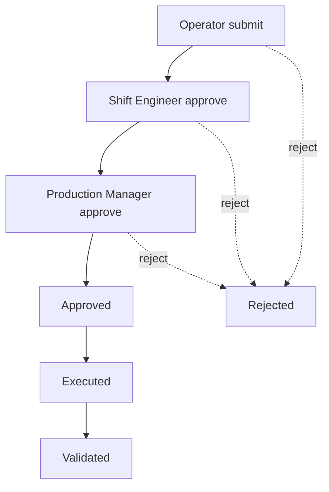
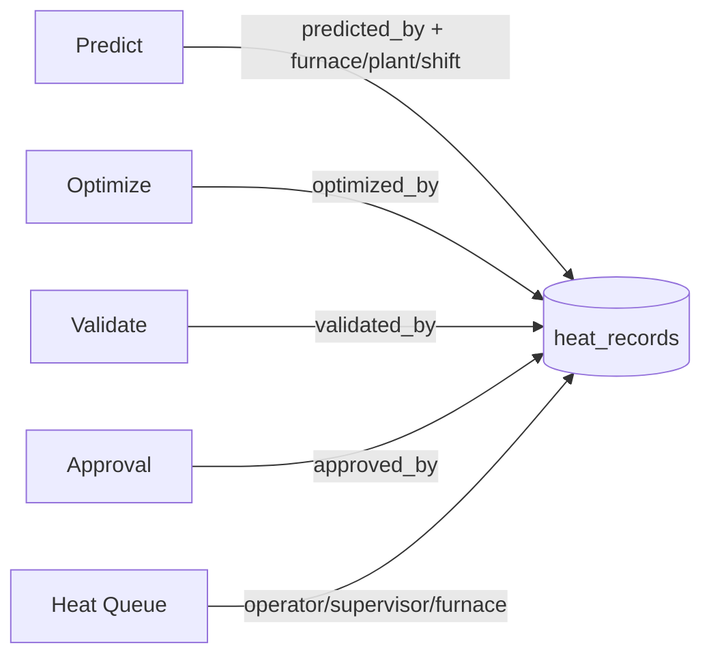
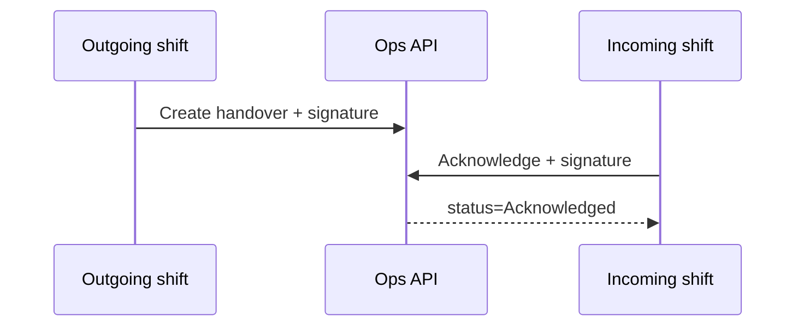

# Production Operations Management — Implementation Report

**Date:** 2026-07-10  
**Scope:** Enterprise workflow around existing AI (Phases 19 / 20.2 / 31 / 32 untouched)  
**Status:** Complete

---

## Summary

The Enterprise RBAC platform is extended into a production operations layer: shifts, furnaces, heat queue, handover, approvals, delays, calendar, tasks, role dashboards, alerts, announcements, search, reporting, and audit — without modifying any ML model, pickle, feature engineering, or training pipeline.

---

## New database tables

Stored in `backend/data/enterprise/enterprise.db` (via `OPS_SCHEMA` in `enterprise_db.py`):

| Table | Purpose |
|-------|---------|
| `furnaces` | Multi-furnace registry (EAF-1, EAF-2, LF-1, …) |
| `shifts` | Shift A/B/C definitions, status, archive |
| `shift_assignments` | Users assigned to shifts (operator / engineer / supervisor) |
| `heat_queue` | Production queue with sort order + status |
| `shift_handovers` | Digital handover + signatures |
| `approval_workflows` | Recommendation approval stages + timestamps |
| `tasks` | Operator / engineer task list |
| `announcements` | Role-scoped notices |
| `calendar_events` | Plant calendar (shift / maintenance / downtime / production / report) |

**Heat attribution columns** (migrated on `heat_records` in `heats.db`):

`furnace_id`, `plant`, `supervisor_id`, `predicted_by`, `optimized_by`, `validated_by`, `approved_by`, `queue_status`

**Delay enhancement:** `delay_events.status` (`Open` / `Investigating` / `Closed`)

---

## New APIs (`/ops/*`)

Router: `backend/app/routers/ops.py` · Service: `backend/app/services/ops_service.py`

| Method | Path | Notes |
|--------|------|-------|
| GET/POST | `/ops/furnaces` | List / create |
| GET/POST | `/ops/shifts` | List / create |
| GET/PATCH | `/ops/shifts/{id}` | Detail / update / archive |
| POST | `/ops/shifts/{id}/assign` | Assign user |
| GET/POST | `/ops/queue` | Production queue |
| PATCH | `/ops/queue/{id}` | Status / attribution |
| POST | `/ops/queue/reorder` | Drag-order (ordered IDs) |
| GET/POST | `/ops/handovers` | Handover create |
| POST | `/ops/handovers/{id}/acknowledge` | Incoming signature |
| GET/POST | `/ops/approvals` | Start workflow |
| POST | `/ops/approvals/{id}/action` | submit / approve_shift / approve_pm / execute / validate / reject |
| GET/POST/PATCH | `/ops/tasks` | Task CRUD |
| GET/POST | `/ops/announcements` | Publish / list by role |
| GET/POST | `/ops/calendar` | Calendar events |
| GET | `/ops/search?q=` | Enterprise search |
| GET | `/ops/dashboards/operator-performance` | Operator KPIs |
| GET | `/ops/dashboards/production-manager` | Live production |
| GET | `/ops/dashboards/shift-performance` | Shift KPIs |
| GET | `/ops/dashboards/analytics` | Throughput / trends |
| GET | `/ops/reports/{kind}` | daily…department |
| POST | `/ops/alerts/generate` | Ops-driven plant alerts |

Seed: `seed_ops()` called from `seed_enterprise()` (furnaces EAF-1/EAF-2/LF-1 + shifts A/B/C).

---

## New frontend pages

| Route | Module |
|-------|--------|
| `/eaf/shifts` | Shift management |
| `/eaf/furnaces` | Furnace registry + active filter |
| `/eaf/heat-queue` | Production queue (↑↓ reorder) |
| `/eaf/shift-handover` | Digital handover |
| `/eaf/approvals` | Approval workflow |
| `/eaf/tasks` | Task management |
| `/eaf/calendar` | Plant calendar (daily/weekly/monthly) |
| `/eaf/announcements` | Announcements |
| `/eaf/search` | Enterprise search |
| `/eaf/operator-performance` | Operator dashboard |
| `/eaf/production-manager` | Production manager dashboard |
| `/eaf/ops-reports` | Ops reports |

Supporting: `src/lib/api/ops.ts`, `src/stores/ops-context-store.ts`, `RoleOpsWidgets` on main dashboard, heat sync attribution in `heat-history-sync.ts`.

---

## Workflow diagrams

### Approval

### Heat attribution

### Shift handover

---

## RBAC updates

New permissions: `ops.view`, `ops.manage`, `tasks.view`, `tasks.manage`

| Role | Ops access |
|------|------------|
| admin | Full |
| plant_manager / production_manager | view + manage + tasks |
| shift_engineer | view + manage + tasks |
| operator | view + tasks.view |
| quality / maintenance | view + tasks.view |
| data_scientist / viewer | ops.view |

Frontend route ACL updated in `permissions.ts`. Middleware maps `/ops/*` and requires bearer token.

---

## Migration guide

1. Pull latest code; no ML artifact changes.
2. Restart FastAPI backend — `ensure_enterprise_db()` applies `OPS_SCHEMA` and delay `status` column; `ensure_db()` adds heat attribution columns; `seed_ops()` seeds furnaces/shifts.
3. Existing enterprise users keep passwords; new permissions are inserted via `INSERT OR IGNORE` on next seed.
4. Frontend: `npm install` (if needed) → `npm run dev`. Set `NEXT_PUBLIC_EAF_API_URL` to the API.
5. Login as `admin@jspl.local` / `Admin@123` to manage shifts/furnaces; operators use `operator@jspl.local` / `Oper@123`.
6. Optional: set active furnace in **Furnaces** page (persisted in `jspl-ops-context`).
7. For local ML regression only: `EAF_REQUIRE_AUTH=0` (default remains auth on).

**Rollback:** Drop ops tables from `enterprise.db` or delete the DB file (users/audit will reseed). Heat attribution columns are additive and safe to leave.

---

## Verification

| Check | Result |
|-------|--------|
| TypeScript (`tsc --noEmit`) | Pass |
| ESLint (ops + nav + sync) | Pass |
| Backend import `/ops` routes | 31 routes registered |
| API smoke (admin login + `/ops/*`) | Pass (200) |
| RBAC (operator create shift) | Pass (403) |
| ML components | Unchanged |
| Production build (`npm run build`) | Run when no other `next` processes are active (dev server may lock the build) |

---

## Explicit non-changes

- Phase 19 Prediction Model  
- Phase 20.2 Optimizer  
- Phase 31 Optimizer V2  
- Phase 32 Hybrid Engine  
- Pickles, feature engineering, training pipeline  
