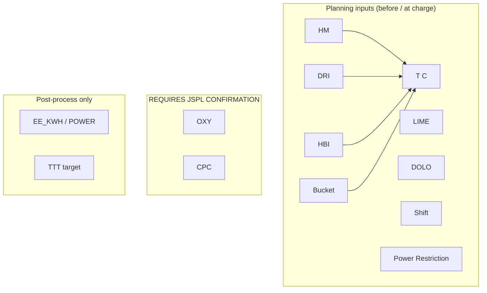
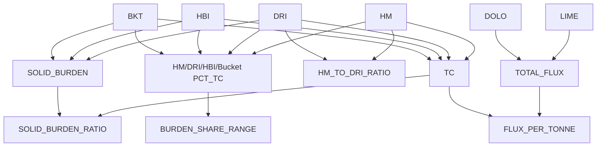
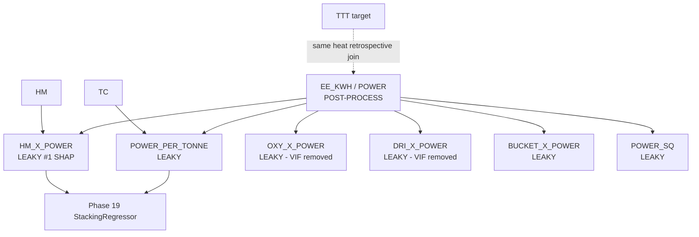
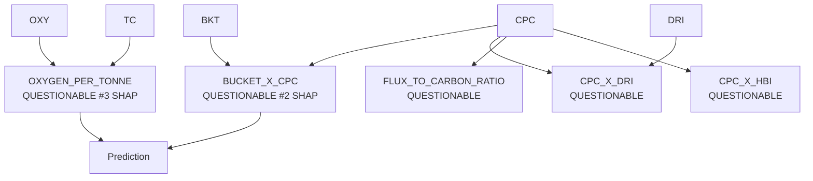
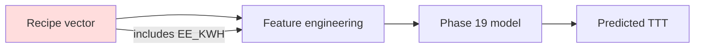

# Phase 23.5 — Feature Dependency Graph

**Audit scope:** Frozen Phase 19 production model (22 features), Phase 16 engineering pool (~109 features), raw operator inputs, optimizer variables.

**Status markers:** `SAFE` | `QUESTIONABLE` | `LEAKY`

---

## 1. Raw Input Layer

| Variable | Status | Rationale |
|----------|--------|-----------|
| HM, DRI, HBI, Bucket | **SAFE** | Charge recipe known at heat start |
| LIME, DOLO | **SAFE** | Committed with recipe (minor timing variance) |
| Shift, T C | **SAFE** | Known before melt |
| Power Restriction | **SAFE** | Operational constraint flag |
| OXY, CPC | **QUESTIONABLE** | Single post-heat row — planned vs final total unknown |
| EE_KWH (POWER) | **LEAKY** | JSPL: recorded only after heat completion |
| TTT | **SAFE** as target only | Must never be an input |

---

## 2. Foundation Derived Features (Phase 16)

| Feature family | Status |
|----------------|--------|
| Burden ratios (`*_PCT_TC`, `*_TO_*_RATIO`, `SOLID_BURDEN_RATIO`, `BURDEN_SHARE_RANGE`) | **SAFE** |
| Flux per tonne (`FLUX_PER_TONNE`, `DOLO_X_LIME`, `DOLO_SQ`) | **SAFE** |
| `CHARGE_BALANCE_ERROR`, `CHARGE_DEVIATION_*` | **SAFE** (QC only; recommend remove from model) |
| `TOTAL_METALLIC_INPUT`, `VIRGIN_BURDEN`, dominance indicators | **SAFE** |

---

## 3. Energy Feature Branch (Critical Leakage Path)

### Causal mechanism (why LEAKY)

1. **EE_KWH = ∫ P_arc(t) dt** over the heat (Knutsen 2020; Sjunnesson 2019).
2. **TTT = t_power-on + t_power-off + delays** — power-on integrates arc energy.
3. Therefore **EE_KWH and TTT are co-generated** during the same heat; using final EE_KWH to predict TTT for that heat uses information that **did not exist at prediction time**.
4. On JSPL data (TTT < 120 min): Pearson(EE_KWH, TTT) ≈ **+0.48** — strengthens on normal heats, consistent with temporal coupling.
5. `POWER_PER_TONNE` = EE_KWH / T C is **specific energy (SEC)** — still post-heat.
6. `HM_X_POWER` = HM × EE_KWH — burden is planning-safe, but product is **not**; model can learn "high energy heats took longer" rather than "this recipe will take longer."

**Train–serve skew:** Phase 19 trained on retrospective rows (actual EE_KWH for heat *i* → TTT for heat *i*). Production UI accepts operator POWER input (often median/historical), which is **not the same information set**.

---

## 4. OXY / CPC Branch (QUESTIONABLE)

| Scenario | Status | Implication |
|----------|--------|-------------|
| OXY/CPC = **planned setpoints** before heat | **SAFE** | Per-tonne and interactions valid for planning model |
| OXY/CPC = **final heat totals** after tap | **LEAKY / HIGH** | Same retrospective leakage as EE_KWH (adjusted during melt based on progress) |
| OXY/CPC = **running total mid-heat** | **Online model only** | Valid for mid-heat update, not initial planning |

**Audit position:** **REQUIRES INDUSTRIAL CONFIRMATION** — do not assume.

---

## 5. Production Model Dependency Tree (22 Features)

```mermaid
flowchart BT
    subgraph SAFE_feats["SAFE (13)"]
        SBR2[SOLID_BURDEN_RATIO]
        HDR2[HM_TO_DRI_RATIO]
        BSR2[BURDEN_SHARE_RANGE]
        HBR[HM_TO_BUCKET_RATIO]
        BXD[BUCKET_X_DOLO]
        FPT2[FLUX_PER_TONNE]
        DXL[DOLO_X_LIME]
        DSQ[DOLO_SQ]
        DHR[DRI_TO_HBI_RATIO]
        BXH[BUCKET_X_HBI]
        DXH[DOLO_X_HBI]
        HSQ[HBI_SQ]
        SL[SHIFT_LABEL]
        SC[SHIFT_C]
    end

    subgraph QUEST_feats["QUESTIONABLE (6)"]
        BXC2[BUCKET_X_CPC]
        OPT2[OXYGEN_PER_TONNE]
        CXD2[CPC_X_DRI]
        FTC2[FLUX_TO_CARBON_RATIO]
        CXH2[CPC_X_HBI]
    end

    subgraph LEAKY_feats["LEAKY (2)"]
        HMP2[HM_X_POWER]
        PPT2[POWER_PER_TONNE]
    end

    subgraph REMOVE_feats["REMOVE from model (1)"]
        CBE[CHARGE_BALANCE_ERROR]
    end

    SAFE_feats --> PRED[TTT Prediction]
    QUEST_feats --> PRED
    LEAKY_feats --> PRED
    REMOVE_feats --> PRED
```

---

## 6. Optimizer Dependency (Phase 20.2) — Audit Only

**Finding:** Optimizer treats `POWER` (EE_KWH) as controllable recipe dimension. Under JSPL temporal semantics, this is **causally inverted** — energy is an outcome, not a planning lever.

---

## 7. List A vs List B Model Placement

### List A — Planning Model (pre-charge)

**SAFE features only** (burden, flux, shift, restriction flag, confirmed-planned O₂/C if verified):

- All burden ratios and HM/DRI/Bucket interactions **without** EE_KWH, OXY, or CPC unless confirmed as setpoints
- `Power_Restriction_Flag`

### List B — Online Model (during melting)

**Additional signals** available after arc start:

- Cumulative EE_KWH(t), cumulative OXY(t), power-on elapsed, delay flags, arc stability proxies
- **Not present** in current JSPL dataset as time series

---

## 8. Master Status Summary (Production 22)

| Feature | Status |
|---------|--------|
| HM_X_POWER | **LEAKY** |
| POWER_PER_TONNE | **LEAKY** |
| OXYGEN_PER_TONNE | **QUESTIONABLE** |
| BUCKET_X_CPC | **QUESTIONABLE** |
| CPC_X_DRI | **QUESTIONABLE** |
| FLUX_TO_CARBON_RATIO | **QUESTIONABLE** |
| CPC_X_HBI | **QUESTIONABLE** |
| All other 15 production features | **SAFE** (CHARGE_BALANCE_ERROR: safe but useless → remove) |

---

*Phase 23.5 — audit only. No pipeline changes.*
