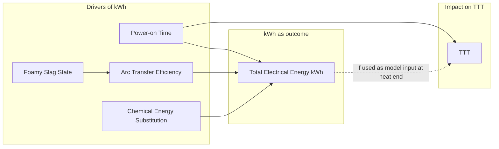
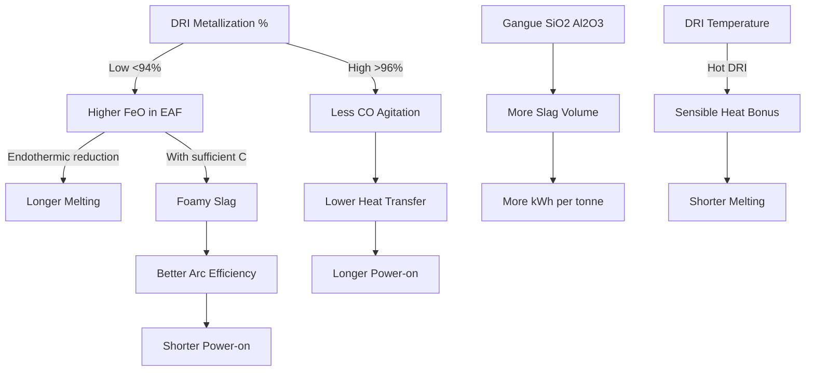
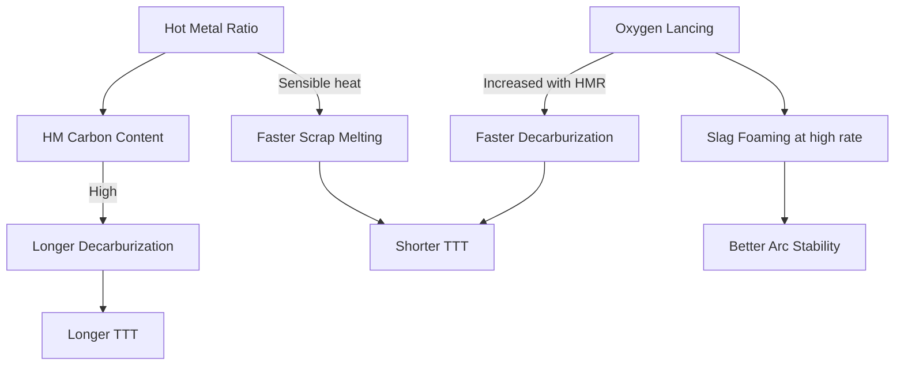
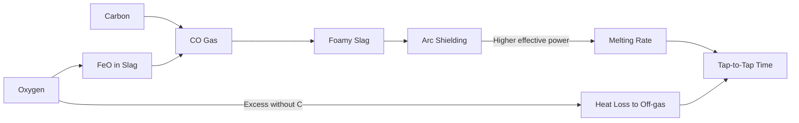

# Phase 23 — Cause-Effect Map: EAF Variables → Tap-to-Tap Time

This document maps **directed** metallurgical relationships supported by peer-reviewed literature. Correlation in plant data is noted separately where it differs from causation.

**Legend**
- `→` direct causal influence (literature-supported)
- `⇢` conditional / nonlinear
- `[R]` response variable
- `[I]` intermediate variable
- `[C]` controllable input
- `[E]` exogenous / constraint

---

## 1. Master Causal Diagram (Literature-Based)

```mermaid
flowchart TB
    subgraph Exogenous["Exogenous / Constraints [E]"]
        PR[Power Restriction]
        DEL[Technological Delays]
        SH[Shift / Crew Context]
        DRIQ[DRI Quality: Metallization Gangue C Temp]
    end

    subgraph Recipe["Recipe Controllables [C]"]
        HM[Hot Metal]
        DRI[DRI Tonnage]
        SCR[Scrap / Bucket]
        HBI[HBI]
        OXY[Oxygen]
        CPC[Carbon CPC]
        LIME[Lime]
        DOLO[Dolomite]
        TC[Total Charge]
    end

    subgraph ProcessState["Intermediate States [I]"]
        SLV[Slag Volume and Basicity]
        FEO[Slag FeO Load]
        FOAM[Foamy Slag / Arc Coverage]
        ARC[Arc Stability and Transfer Efficiency]
        DEC[Decarburization Rate]
        POT[Transformer Power Setpoint]
        PON[Power-on Time]
        POFF[Power-off Time]
        ELEC[Electrical Energy kWh]
    end

    TTT[Tap-to-Tap Time [R]]

  DRIQ --> FEO
    DRIQ --> SLV
    DRI --> FEO
    DRI --> SLV
    HM --> DEC
    HM --> POT
    SCR --> ARC
    HBI --> FEO
    OXY --> DEC
    OXY --> FEO
    CPC --> FOAM
    CPC --> DEC
    LIME --> SLV
    DOLO --> SLV
    FEO --> FOAM
    OXY --> FOAM
    SLV --> ELEC
    FOAM --> ARC
    ARC --> POT
    POT --> PON
    PR --> POT
    DEC --> PON
    HM --> PON
    SCR --> PON
    DRI --> PON
    DEL --> POFF
    PON --> ELEC
    PON --> TTT
    POFF --> TTT
    ELEC -.->|consequence not independent cause| TTT
    TC --> PON
    SH -.-> DEL
```

---

## 2. TTT Decomposition (Knutsen 2020; Sjunnesson 2019)

```
TTT = t_charging + t_melting + t_refining + t_extended_refining + t_tapping + t_turnaround + t_delays
```

| Sub-phase | Primary drivers | Effect on total TTT |
|-----------|-----------------|---------------------|
| Charging | Bucket logistics, DRI feed rate, delay | Power-off dominated |
| Melting | HM sensible heat, scrap pile, arc power, foam | Power-on dominated |
| Refining | Decarburization, O₂, slag chemistry | Power-on + O₂ |
| Extended refining | Off-spec chemistry/temperature | High energy loss rate |
| Tapping / turnaround | EBT practice, maintenance | Power-off |
| Delays | Equipment, power restriction, material supply | Power-off; amplifies radiation losses |

**Key insight:** Sub-phase **timing of delays** matters — a delay during molten refining costs more energy per minute than a delay before arc start (L1).

---

## 3. Electrical Energy (kWh) — Dual Role



**Causality statement (L2):** Using both `power-on time` and `total kWh` to predict each other or TTT without temporal structure creates **circular reasoning**. For TTT prediction at recipe submission:
- **Valid:** HM, DRI, scrap, planned O₂/C, fluxes, charge, restriction flags.
- **Invalid without real-time update:** end-of-heat total kWh.

---

## 4. DRI & Metallization Branch



**Answer: Does higher DRI always reduce TTT?**

| Condition | Expected TTT effect | Reference |
|-----------|---------------------|-----------|
| Cold low-grade DRI, fixed O₂/C | **Increase** | L4, L3 |
| Hot DRI 600°C, 94–96% metallization | **Decrease** vs cold | L3, TERI |
| High DRI replacing HM without O₂ boost | **Ambiguous / increase** | L5 |
| High DRI with optimized slag + carbon foam | **Decrease energy**; TTT may still rise vs pure scrap | L4, L7 |

---

## 5. Hot Metal Branch



**Duan et al. (2014):** Without O₂ coordination, HM benefit on TTT is not realized.

---

## 6. Oxygen × Carbon × Foamy Slag Loop



**Morales (2025); Kirschen (2011):** DRI-heavy heats need more C/O₂ to sustain foam because FeO load is higher.

---

## 7. Flux / Basicity Branch

```
DRI gangue (SiO₂) → need CaO (lime) → slag volume ↑ → melting energy ↑ (0.37–0.50 kWh/kg slag former)
MgO (doloma) → refractory protection + viscosity → foaming behavior
Basicity B ≈ 1.8–2.1 → dephosphorization vs volume trade-off (L4, L13)
```

**Effect on TTT:** Indirect — excess flux adds slag to melt (extends power-on); insufficient flux causes refractory damage and operational delays.

---

## 8. JSPL Data vs Causal Map — Misalignment Points

| Causal path | In JSPL data? | In production model? | Risk |
|-------------|---------------|----------------------|------|
| Metallization → arc stability | **No** | No | Cannot test expert hypothesis |
| Foamy slag state | **No** | Proxied via C/O₂ | Model reliance on proxies |
| Power-on vs power-off split | **No** | No | TTT is aggregate |
| End-of-heat kWh → TTT | **Yes (POWER)** | HM_X_POWER, POWER_PER_TONNE | **Leakage** |
| HM×O₂ coordination | Partial (separate features) | HM_X_POWER instead of HM_X_OXY | Suboptimal interaction |
| Delay regime | Implicit outliers | Single model | Heterogeneity |

---

## 9. Optimizer Causal Assumptions (Phase 20.2)

Current optimizer (`recipe_optimizer.py`) causal graph **assumes:**

```
Recipe vars (incl. POWER, OXY) → TTT prediction → penalties
```

**Literature-contradicted edges:**
- `POWER` (kWh) as free controllable **independent** of predicted TTT — should be **outcome** or bounded policy variable.
- No explicit `metallization` or `delay` nodes.
- HM/DRI anti-correlated move — **aligned** with Duan (2014) substitution practice.

---

## 10. Recommended Causal Hierarchy for Phase 24 Modeling

**Tier 1 — Pre-heat controllables (causal parents):**
HM, DRI, HBI, Bucket, LIME, DOLO, CPC, OXY (planned), T C, Shift, Power_Restriction, DRI_quality (if available)

**Tier 2 — Intermediate (latent or measured mid-heat):**
Power-on time, foamy slag proxy, decarb rate, arc efficiency

**Tier 3 — Outcomes (do not use as inputs for prospective TTT):**
Total kWh, tap weight, final TTT (target), delay minutes

**Tier 4 — Retrospective analysis only:**
Actual kWh, actual vs planned O₂, realized SEC (kWh/t)

---

*Phase 23 — research only.*
