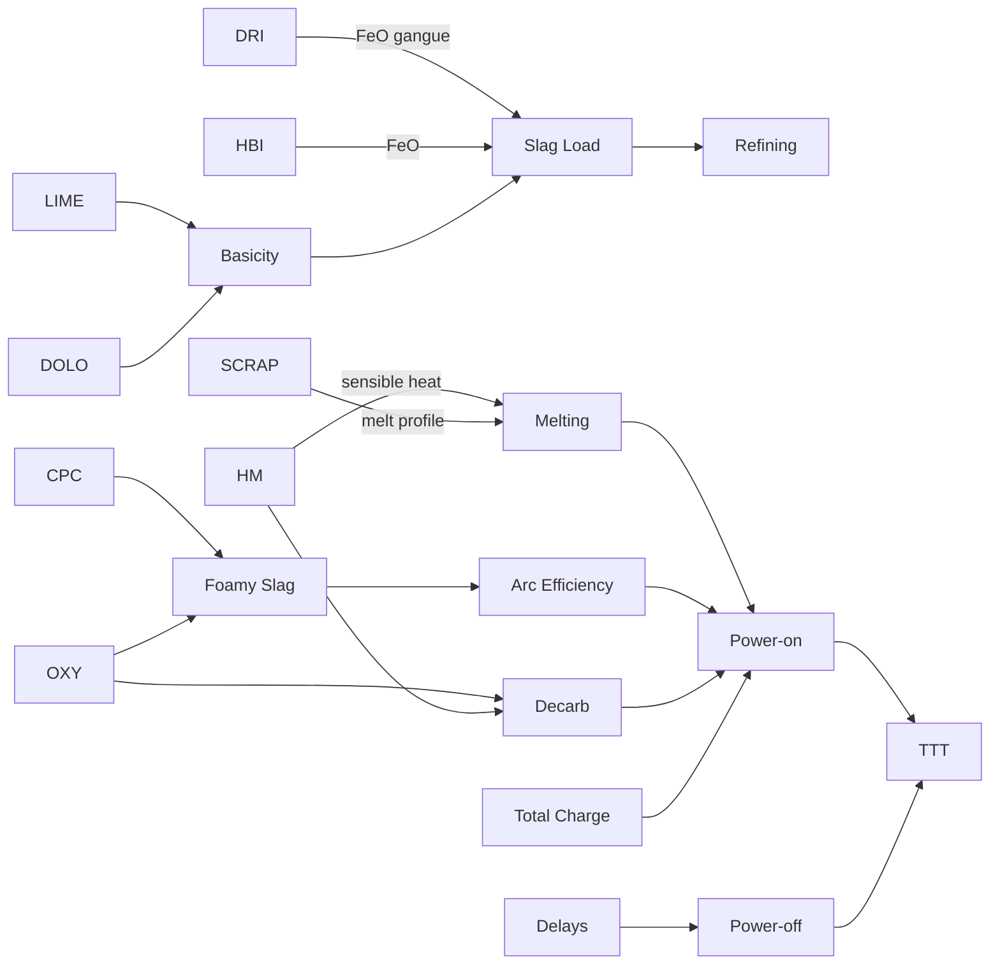

# Phase 26 — Metallurgical Knowledge Graph

Source: Phase 23 literature review (Knutsen 2020; Sjunnesson 2019; Kirschen 2011;
Memoli 2021; Duan 2014; Yang 2023; Morales 2025; Štore Steel 2019).

## Directed relationships → Tap-to-Tap Time

| Source | Relation | Target / Path | Expected TTT effect | Reference |
|--------|----------|---------------|---------------------|-----------|
| HM | → sensible heat → | melting / power-on | ↓ TTT (if O₂ matched) | Duan 2014; Yang 2023 |
| DRI | → FeO / gangue → | slag volume / refining | ↑ TTT (conditional) | Kirschen 2011; Memoli 2021 |
| HBI | → FeO load → | melting | ↑ TTT (sparse JSPL) | Memoli 2021 |
| Scrap | → melt profile → | arc / melting | nonlinear | Memoli 2021 |
| Lime | → basicity → | slag volume | weak ↑ / conditional | Memoli 2021 |
| Dolomite | → MgO saturation → | refractory / slag | conditional | Memoli 2021 |
| Carbon (CPC) | → foamy slag → | arc coverage → melt rate | ↓ TTT | Morales 2025 |
| Oxygen | → decarb / FeO → | refining time | ↓ TTT if balanced | Duan 2014 |
| CPC × Scrap | → foam with scrap | arc efficiency | ↓ TTT | Morales 2025 |
| CPC × DRI | → FeO reduction foam | arc efficiency | ↓ TTT | Kirschen 2011 |
| HM × O₂ | → coordinated refining | decarburization | ↓ TTT | Duan 2014 |
| Total charge | → mass to melt | power-on | ↑ TTT | Pfeifer 2011 |
| Shift | ⇢ delays / crew | power-off | weak | ops literature |
| Energy (kWh) | consequence of TTT | do **not** use as input | leakage | Knutsen 2020 |
| Delays | → power-off | TTT | ↑↑ TTT | Štore Steel 2019 |

## Mermaid knowledge graph

## Feature-discovery implications

1. Prefer **composition shares and coordination indices** over raw tonnes alone.
2. Proxy **foamy slag** via C–O–scrap–DRI balance (no direct foam sensor).
3. Proxy **slag chemistry** via flux / solid burden / DRI share (no SiO₂ assay).
4. Reject any feature using end-of-heat kWh (POWER).
5. Entropy / diversity indices capture **charge heterogeneity** linked to melt unpredictability.
