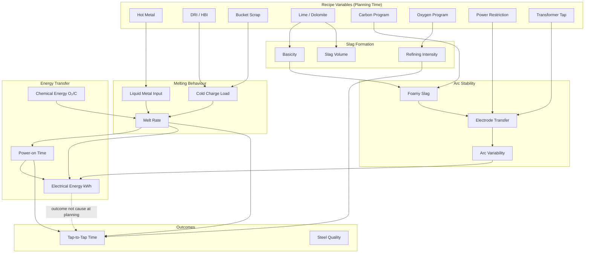
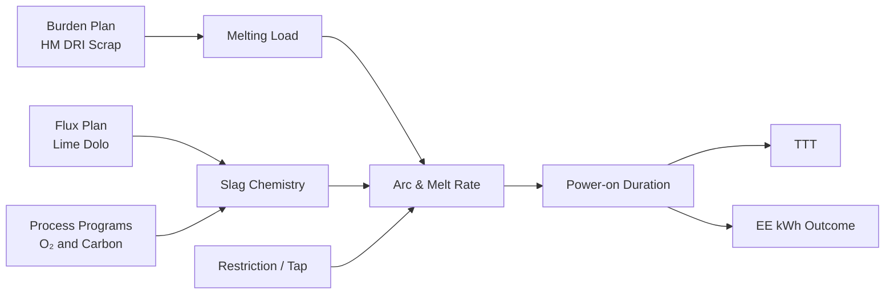

# Industrial Causal Graph — EAF Tap-to-Tap Process

**Phase 30 — Research artifact**  
**Purpose:** Directed causal structure from recipe planning through TTT outcome

---

## Master Process Flow



---

## Edge Catalogue

### Recipe → Melting

| Edge | Industrial explanation | Literature | JSPL evidence |
|------|------------------------|------------|---------------|
| HM → liquid input | Hot metal provides sensible heat; reduces electrical melting duty | Kirschen 2011; Duan 2014 | HM median 58.5 t; HM↑ correlates with lower OXY in historical data |
| DRI/Scrap → cold load | Solid charge requires latent heat + arcing time | Memoli 2021; Štore Steel 2019 | Bucket>5 t → +3,500 kWh mean vs no bucket |
| HM ↔ DRI | Operators trade liquid vs solid to balance availability | Plant practice | r = −0.31 HM–DRI in 12,758 heats |

### Melting → Arc Stability

| Edge | Industrial explanation | Literature | JSPL evidence |
|------|------------------------|------------|---------------|
| Carbon → foaming | CO generation supports foamy slag, improves arc transfer | Kirschen 2011; Skupien foaming | CPC in top optimizer adjustments |
| Flux → basicity → foaming | Lime/dolo control slag chemistry and foaming potential | Memoli 2015 AusIMM | Lime/dolomite imbalance flagged in 3/10 live heats |
| Tap → arc transfer | Transformer tap sets voltage/current profile | Pfeifer 2011 | Not in current dataset |

### Arc → Energy Transfer

| Edge | Industrial explanation | Literature | JSPL evidence |
|------|------------------------|------------|---------------|
| Power-on time → EE_KWH | Energy = ∫ power dt over arcing duration | Knutsen 2020; Sjunnesson 2019 | POWER post-tap; correlates with TTT (r=0.48 normal heats) |
| Restriction → arc efficiency | Grid limits force lower tap → longer melt | JSPL practice | Power_Restriction in API, not optimizer |
| **EE_KWH ↛ planning** | **Cannot set kWh before heat** | Phase 23.5 leakage audit | JSPL confirmed post-process |

### Refining → TTT

| Edge | Industrial explanation | Literature | JSPL evidence |
|------|------------------------|------------|---------------|
| O₂ program → refining time | Oxygen drives decarburization and slag FeO | Duan 2014 | High OXY live heat 4618204 → Low confidence |
| Lime → slag volume → time | Excess flux adds slag handling time | Memoli 2021 | P75 LIME → +2.1 min mean TTT vs P25 |
| Delays → TTT | Maintenance/technological waits dominate outliers | Štore Steel 2019 | 299 heats TTT>120 min in training |

---

## Critical Causal Correction for Optimizer

**Wrong (Phase 20.2):**
```
Recipe including POWER → minimize TTT
```

**Correct (Phase 30):**
```
Planning recipe (burden + flux + O₂/C programs + constraints)
    → predicted melting/refining path
    → predicted TTT
    → predicted EE_KWH band (informational only)
```

---

## Mermaid — Simplified Operator View



---

*This graph is research documentation. Production model and optimizer are unchanged.*
